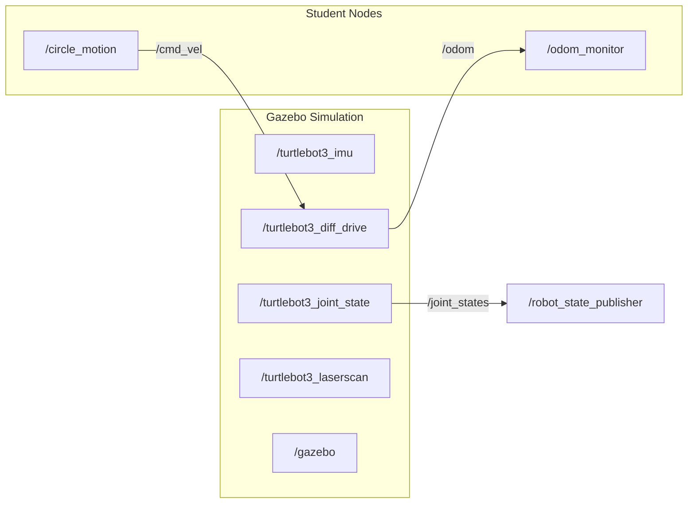
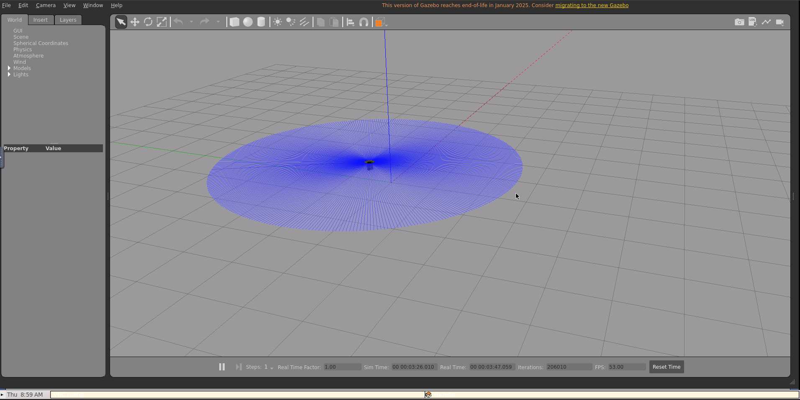

# Lecture 6: ROS 2 Fundamentals — Topics, Nodes & Communication — Solution

> DevOps for Cyber-Physical Systems | University of Bern

- **Name:** Prakash Aryan
- **ROS 2 Version:** Humble Hawksbill
- **Repository:** [github.com/prakash-aryan/lecture6-ros2demo](https://github.com/prakash-aryan/lecture6-ros2demo)

## ROS 2 Communication Architecture



## Project Structure

```
lecture6-ros2demo/
├── .devcontainer/
│   ├── Dockerfile
│   ├── devcontainer.json
│   ├── post-create.sh
│   ├── post-start.sh          # Auto-builds student_robotics
│   └── verify-setup.sh
├── src/
│   ├── student_robotics/       # ← Exercise package
│   │   ├── student_robotics/
│   │   │   ├── __init__.py
│   │   │   ├── circle_motion.py    # Velocity publisher
│   │   │   └── odom_monitor.py     # Odometry subscriber
│   │   ├── launch/
│   │   │   └── robot.launch.py
│   │   ├── resource/
│   │   │   └── student_robotics
│   │   ├── package.xml
│   │   ├── setup.py
│   │   └── setup.cfg
│   ├── DynamixelSDK/
│   ├── turtlebot3/
│   ├── turtlebot3_msgs/
│   └── turtlebot3_simulations/
├── screenshots/                # Solution screenshots
└── README.md
```

---

# Aufgabe 1: Create ROS2 Package & Publisher-Subscriber Nodes

## (a) Package Creation & Circle Motion Publisher

Created package `student_robotics` with a publisher node that drives TurtleBot3 in a circle.

**Build & run:**

```bash
cd /workspace/turtlebot3_ws
colcon build --packages-select student_robotics
source install/setup.bash
ros2 run student_robotics circle_motion
```

### circle_motion.py

```python
import rclpy
from rclpy.node import Node
from geometry_msgs.msg import Twist


class CircleMotion(Node):
    """
    ROS 2 publisher node that drives TurtleBot3 in a circle.

    Publishes Twist messages to /cmd_vel at 10 Hz with:
      - linear.x  = 0.3 m/s   (forward speed)
      - angular.z = 0.5 rad/s  (turn rate)
    """

    def __init__(self):
        super().__init__('circle_motion')

        # Create publisher on /cmd_vel with QoS depth 10
        self.publisher = self.create_publisher(Twist, '/cmd_vel', 10)

        # 10 Hz timer → callback every 0.1 s
        self.timer = self.create_timer(0.1, self.timer_callback)

        self.get_logger().info(
            'CircleMotion started — publishing to /cmd_vel at 10 Hz')

    def timer_callback(self):
        msg = Twist()
        msg.linear.x = 0.3   # m/s forward
        msg.angular.z = 0.5  # rad/s counter-clockwise
        self.publisher.publish(msg)
        self.get_logger().info(
            f'Velocity → linear.x={msg.linear.x:.1f}, angular.z={msg.angular.z:.1f}')


def main(args=None):
    rclpy.init(args=args)
    node = CircleMotion()
    try:
        rclpy.spin(node)
    except KeyboardInterrupt:
        pass
    finally:
        # Stop the robot before shutting down
        stop_msg = Twist()
        node.publisher.publish(stop_msg)
        node.destroy_node()
        rclpy.shutdown()


if __name__ == '__main__':
    main()
```

### Build output

```
Starting >>> student_robotics
Finished <<< student_robotics [2.37s]

Summary: 1 package finished [56.2s]
```

### circle_motion node running

```
[INFO] [1774515473.565195389] [circle_motion]: CircleMotion started — publishing to /cmd_vel at 10 Hz
[INFO] [1774515473.863745942] [circle_motion]: Velocity → linear.x=0.3, angular.z=0.5
[INFO] [1774515473.969675095] [circle_motion]: Velocity → linear.x=0.3, angular.z=0.5
[INFO] [1774515474.064554060] [circle_motion]: Velocity → linear.x=0.3, angular.z=0.5
[INFO] [1774515474.164401815] [circle_motion]: Velocity → linear.x=0.3, angular.z=0.5
[INFO] [1774515474.264625951] [circle_motion]: Velocity → linear.x=0.3, angular.z=0.5
[INFO] [1774515474.368877758] [circle_motion]: Velocity → linear.x=0.3, angular.z=0.5
[INFO] [1774515474.458057746] [circle_motion]: Velocity → linear.x=0.3, angular.z=0.5
```

### Robot moving in circles in Gazebo




The blue trail shows the TurtleBot3 tracing a circular path from the constant linear (0.3 m/s) and angular (0.5 rad/s) velocity commands.

### Why use `create_timer()`?

`create_timer()` triggers a callback at a fixed frequency (10 Hz), ensuring the robot receives a steady stream of velocity commands. Without a timer the node would publish once and exit, whereas the timer keeps the publisher alive and publishes periodically for continuous motion control.

---

## (b) Odometry Subscriber

Created `odom_monitor.py` that subscribes to `/odom` and logs the robot's position and velocities.

### odom_monitor.py

```python
import rclpy
from rclpy.node import Node
from nav_msgs.msg import Odometry


class OdomMonitor(Node):
    """
    ROS 2 subscriber node that monitors TurtleBot3 odometry.

    Subscribes to /odom and logs:
      - Position:   (x, y)
      - Velocities: (linear.x, angular.z)
    """

    def __init__(self):
        super().__init__('odom_monitor')

        # Subscribe to /odom with QoS depth 10
        self.subscription = self.create_subscription(
            Odometry,
            '/odom',
            self.odom_callback,
            10)

        self.get_logger().info(
            'OdomMonitor started — listening to /odom')

    def odom_callback(self, msg):
        # Extract position
        x = msg.pose.pose.position.x
        y = msg.pose.pose.position.y

        # Extract velocities
        vx = msg.twist.twist.linear.x
        wz = msg.twist.twist.angular.z

        self.get_logger().info(
            f'Position: x={x:.2f}, y={y:.2f} | '
            f'Velocity: linear.x={vx:.2f}, angular.z={wz:.2f}')


def main(args=None):
    rclpy.init(args=args)
    node = OdomMonitor()
    try:
        rclpy.spin(node)
    except KeyboardInterrupt:
        pass
    finally:
        node.destroy_node()
        rclpy.shutdown()


if __name__ == '__main__':
    main()
```

### Both nodes running — terminal output

```
[INFO] [1774515499.579080843] [odom_monitor]: OdomMonitor started — listening to /odom
[INFO] [1774515499.582496855] [odom_monitor]: Position: x=-0.50, y=0.36 | Velocity: linear.x=0.30, angular.z=0.50
[INFO] [1774515499.603736754] [odom_monitor]: Position: x=-0.49, y=0.35 | Velocity: linear.x=0.30, angular.z=0.50
[INFO] [1774515499.637242866] [odom_monitor]: Position: x=-0.49, y=0.34 | Velocity: linear.x=0.30, angular.z=0.50
[INFO] [1774515499.670841967] [odom_monitor]: Position: x=-0.49, y=0.33 | Velocity: linear.x=0.30, angular.z=0.50
[INFO] [1774515499.704259430] [odom_monitor]: Position: x=-0.48, y=0.32 | Velocity: linear.x=0.30, angular.z=0.50
[INFO] [1774515499.739537848] [odom_monitor]: Position: x=-0.48, y=0.31 | Velocity: linear.x=0.30, angular.z=0.50
[INFO] [1774515499.774530145] [odom_monitor]: Position: x=-0.47, y=0.30 | Velocity: linear.x=0.30, angular.z=0.50
[INFO] [1774515499.807936940] [odom_monitor]: Position: x=-0.47, y=0.29 | Velocity: linear.x=0.30, angular.z=0.50
[INFO] [1774515499.841032495] [odom_monitor]: Position: x=-0.46, y=0.28 | Velocity: linear.x=0.30, angular.z=0.50
[INFO] [1774515499.874687245] [odom_monitor]: Position: x=-0.46, y=0.28 | Velocity: linear.x=0.30, angular.z=0.50
[INFO] [1774515499.909097212] [odom_monitor]: Position: x=-0.45, y=0.27 | Velocity: linear.x=0.30, angular.z=0.50
[INFO] [1774515499.943231809] [odom_monitor]: Position: x=-0.45, y=0.26 | Velocity: linear.x=0.30, angular.z=0.50
[INFO] [1774515499.977811038] [odom_monitor]: Position: x=-0.44, y=0.25 | Velocity: linear.x=0.30, angular.z=0.50
[INFO] [1774515500.011371073] [odom_monitor]: Position: x=-0.44, y=0.24 | Velocity: linear.x=0.30, angular.z=0.50
[INFO] [1774515500.046069217] [odom_monitor]: Position: x=-0.43, y=0.23 | Velocity: linear.x=0.30, angular.z=0.50
[INFO] [1774515500.080109577] [odom_monitor]: Position: x=-0.42, y=0.22 | Velocity: linear.x=0.30, angular.z=0.50
[INFO] [1774515500.114151260] [odom_monitor]: Position: x=-0.42, y=0.22 | Velocity: linear.x=0.30, angular.z=0.50
[INFO] [1774515500.147850578] [odom_monitor]: Position: x=-0.41, y=0.21 | Velocity: linear.x=0.30, angular.z=0.50
[INFO] [1774515500.182498278] [odom_monitor]: Position: x=-0.41, y=0.20 | Velocity: linear.x=0.30, angular.z=0.50
[INFO] [1774515500.216836308] [odom_monitor]: Position: x=-0.40, y=0.19 | Velocity: linear.x=0.30, angular.z=0.50
```

The changing (x, y) coordinates and steady velocities confirm the robot is moving in a circle.

### `ros2 node list` — both nodes active

```
/circle_motion
/gazebo
/odom_monitor
/robot_state_publisher
/turtlebot3_diff_drive
/turtlebot3_imu
/turtlebot3_joint_state
/turtlebot3_laserscan
```

### How does pub-sub decoupling work?

In ROS 2's publish-subscribe model, publishers and subscribers are completely decoupled — the publisher does not know who (or if anyone) is listening, and the subscriber does not know who is producing the data. They only share a topic name and message type, and the DDS middleware handles matching and delivery. This means nodes can be started, stopped, or replaced independently without affecting other parts of the system, making the architecture modular and fault-tolerant.

---

# Aufgabe 2: ROS2 Topic Inspection & Message Frequency Analysis

## (a) ROS2 CLI Topic Commands

All commands run while TurtleBot3 Gazebo simulation, `circle_motion`, and `odom_monitor` are active.

### `ros2 topic list`

```
/clock
/cmd_vel
/imu
/joint_states
/odom
/parameter_events
/performance_metrics
/robot_description
/rosout
/scan
/tf
/tf_static
```

### `ros2 topic info /cmd_vel`

```
Type: geometry_msgs/msg/Twist
Publisher count: 1
Subscription count: 1
```

### `ros2 topic info /odom`

```
Type: nav_msgs/msg/Odometry
Publisher count: 1
Subscription count: 1
```

### `ros2 topic hz /odom`

```
average rate: 29.373
        min: 0.033s max: 0.035s std dev: 0.00047s window: 31
average rate: 29.376
        min: 0.033s max: 0.035s std dev: 0.00046s window: 61
average rate: 29.351
        min: 0.033s max: 0.035s std dev: 0.00047s window: 91
average rate: 29.368
        min: 0.033s max: 0.037s std dev: 0.00056s window: 121
average rate: 29.368
        min: 0.033s max: 0.037s std dev: 0.00054s window: 151
average rate: 29.370
        min: 0.033s max: 0.037s std dev: 0.00052s window: 181
average rate: 29.363
        min: 0.033s max: 0.037s std dev: 0.00051s window: 211
```

### `ros2 topic bw /odom`

```
Subscribed to [/odom]
21.32 KB/s from 29 messages
        Message size mean: 0.72 KB min: 0.72 KB max: 0.72 KB
21.52 KB/s from 59 messages
        Message size mean: 0.72 KB min: 0.72 KB max: 0.72 KB
21.35 KB/s from 88 messages
        Message size mean: 0.72 KB min: 0.72 KB max: 0.72 KB
21.26 KB/s from 100 messages
        Message size mean: 0.72 KB min: 0.72 KB max: 0.72 KB
```

### `ros2 node info /circle_motion`

```
/circle_motion
  Subscribers:

  Publishers:
    /cmd_vel: geometry_msgs/msg/Twist
    /parameter_events: rcl_interfaces/msg/ParameterEvent
    /rosout: rcl_interfaces/msg/Log
  Service Servers:
    /circle_motion/describe_parameters: rcl_interfaces/srv/DescribeParameters
    /circle_motion/get_parameter_types: rcl_interfaces/srv/GetParameterTypes
    /circle_motion/get_parameters: rcl_interfaces/srv/GetParameters
    /circle_motion/list_parameters: rcl_interfaces/srv/ListParameters
    /circle_motion/set_parameters: rcl_interfaces/srv/SetParameters
    /circle_motion/set_parameters_atomically: rcl_interfaces/srv/SetParametersAtomically
  Service Clients:

  Action Servers:

  Action Clients:
```

### What is the `/odom` frequency? Why does frequency matter?

The `/odom` topic publishes at approximately **29.4 Hz** (roughly 30 times per second), as reported by `ros2 topic hz`. Frequency matters because a higher odometry rate gives the control loop more up-to-date position data, enabling smoother and more accurate robot motion. If the frequency is too low, the robot may overshoot targets or react too slowly to changes.

### How many publishers/subscribers does `/cmd_vel` have?

`/cmd_vel` has **1 publisher** and **1 subscriber**:
- **Publisher:** `/circle_motion` — our custom node publishing Twist velocity commands
- **Subscriber:** `/turtlebot3_diff_drive` — the Gazebo differential-drive plugin that actuates the robot's wheels

### Difference between `ros2 topic hz` and `ros2 topic bw`?

`ros2 topic hz` measures the **message frequency** — how many messages per second arrive on a topic (e.g. ~29.4 Hz for `/odom`). `ros2 topic bw` measures the **bandwidth** — the total data throughput in KB/s, taking into account both frequency and message size (e.g. ~21.3 KB/s for `/odom` with 0.72 KB messages).

---

## (b) Visualize Communication Graph

```bash
rqt_graph
```


### What does the graph show?

The `rqt_graph` visualizes the ROS 2 computation graph, showing all active nodes (ellipses) and the topics (labeled arrows) connecting them. Our `/circle_motion` node publishes to `/cmd_vel`, which is consumed by `/turtlebot3_diff_drive`; the diff-drive plugin then publishes `/odom`, which our `/odom_monitor` subscribes to. Other Gazebo nodes (`/turtlebot3_imu`, `/turtlebot3_joint_state`, `/turtlebot3_laserscan`) are also visible, feeding sensor data into the system.

### What happens if you stop `circle_motion`? Does `odom_monitor` still work?

If `circle_motion` is stopped, the robot stops moving (no more Twist commands on `/cmd_vel`), but `odom_monitor` continues to run and receive `/odom` messages — the position simply stays constant. This is because publishers and subscribers are decoupled; the subscriber does not depend on any specific publisher being alive, it only listens on the topic.

---

## Quick Start (Dev Container)

```bash
# Terminal 1 — Launch Gazebo empty world
ros2 launch turtlebot3_gazebo empty_world.launch.py

# Terminal 2 — Build & run circle_motion publisher
cd /workspace/turtlebot3_ws
colcon build --packages-select student_robotics
source install/setup.bash
ros2 run student_robotics circle_motion

# Terminal 3 — Run odom_monitor subscriber
source /workspace/turtlebot3_ws/install/setup.bash
ros2 run student_robotics odom_monitor

# Or launch both together
ros2 launch student_robotics robot.launch.py

# Terminal 4 — Inspect topics
ros2 topic list
ros2 topic info /cmd_vel
ros2 topic hz /odom
ros2 node list

# Terminal 5 (VNC) — Visualize
rqt_graph
```

---

**University of Bern | DevOps for Cyber-Physical Systems**
