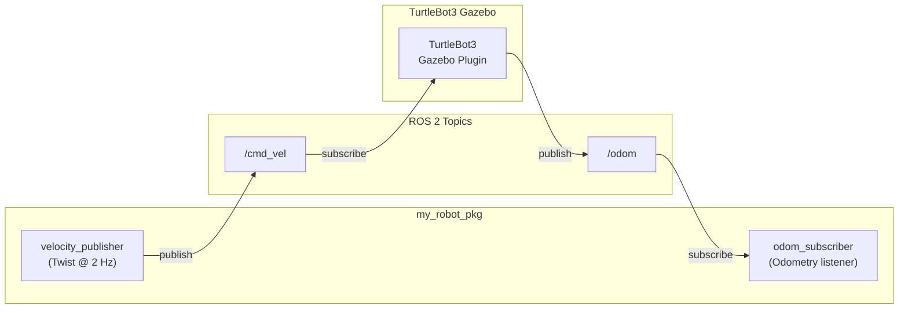
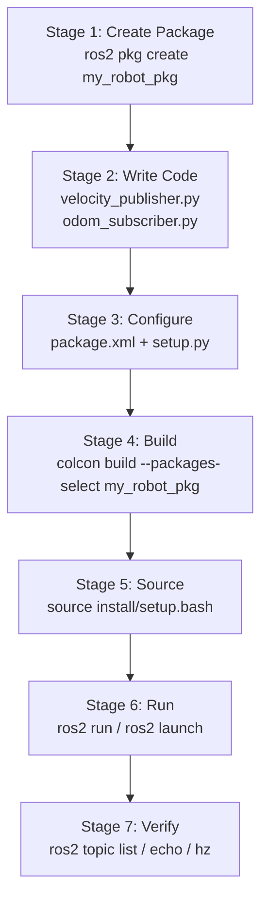
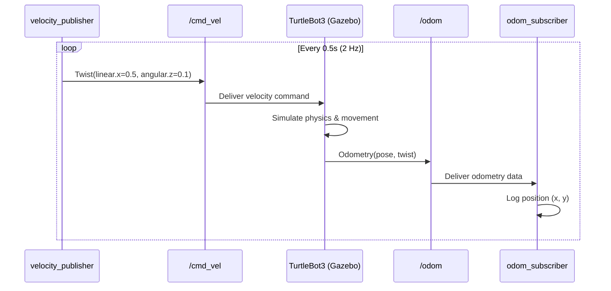

# Lecture 6: ROS 2 Concepts & Building Software Packages — Solution

> DevOps for Cyber-Physical Systems | University of Bern

A ROS 2 Python package (`my_robot_pkg`) demonstrating publisher/subscriber communication patterns with TurtleBot3 in Gazebo simulation.

## Quick Start (Solution Branch)

### 1. Open in Dev Container

```bash
git clone https://github.com/prakash-aryan/lecture6-ros2demo.git
cd lecture6-ros2demo
git checkout solution
code .
```

In VS Code: **F1** → "Dev Containers: Reopen in Container" — wait for build (first time ~10-15 min).

`my_robot_pkg` is built automatically by the `post-start.sh` script.

### 2. Launch Gazebo + TurtleBot3

Open the VNC desktop at http://localhost:6080 (password: `ros`), then in the VS Code terminal:

```bash
# Terminal 1 — Start simulation
tb3_empty
```

Wait 30–60 seconds for Gazebo to fully load.

### 3. Run the Exercise Package

```bash
# Terminal 2 — Launch both nodes at once
ros2 launch my_robot_pkg robot.launch.py
```

Or run them individually:

```bash
# Terminal 2 — Velocity publisher (robot starts moving)
ros2 run my_robot_pkg velocity_publisher

# Terminal 3 — Odometry subscriber (prints position)
ros2 run my_robot_pkg odom_subscriber
```

### 4. Verify with ROS 2 Tools

```bash
# Terminal 4 — Inspect the system
ros2 topic list              # See all active topics
ros2 topic echo /cmd_vel     # Watch velocity commands
ros2 topic hz /cmd_vel       # Confirm 2 Hz publish rate
ros2 node list               # See running nodes
rqt_graph                    # Visual computation graph
```

### Manual Build (if needed)

If the auto-build didn't run or you modified the code:

```bash
cd /workspace/turtlebot3_ws
colcon build --packages-select my_robot_pkg
source install/setup.bash
```

---

## Architecture

**ROS 2 Communication:**


**Package Development Workflow:**


## Project Structure

```
lecture6-ros2demo/
├── .devcontainer/
│   ├── Dockerfile               # ROS 2 Humble container
│   ├── devcontainer.json        # VS Code Dev Container config
│   ├── post-create.sh           # One-time setup script
│   ├── post-start.sh            # Runs each container start
│   └── verify-setup.sh          # Verifies environment
├── src/
│   ├── my_robot_pkg/            # ★ Exercise solution package
│   │   ├── my_robot_pkg/
│   │   │   ├── __init__.py
│   │   │   ├── velocity_publisher.py   # Publishes to /cmd_vel
│   │   │   └── odom_subscriber.py      # Subscribes to /odom
│   │   ├── launch/
│   │   │   └── robot.launch.py         # Launches both nodes
│   │   ├── resource/
│   │   │   └── my_robot_pkg
│   │   ├── package.xml                 # Package metadata & deps
│   │   ├── setup.py                    # Python package config
│   │   └── setup.cfg                   # Install behavior
│   ├── DynamixelSDK/            # Motor control SDK
│   ├── turtlebot3/              # TurtleBot3 packages
│   ├── turtlebot3_msgs/         # TurtleBot3 messages
│   └── turtlebot3_simulations/  # Gazebo simulation
├── .gitignore
├── LICENSE
└── README.md                    # This file
```

---

# Exercise: Create a ROS 2 Package for TurtleBot3 Control

## Task 1: Create the Package

### (a) Create Python Package Structure

Navigate to the workspace source directory and create a new ROS 2 Python package:

```bash
cd /workspace/turtlebot3_ws/src

ros2 pkg create my_robot_pkg \
  --build-type ament_python \
  --dependencies rclpy geometry_msgs
```

```
going to create a new package
package name: my_robot_pkg
destination directory: /workspace/turtlebot3_ws/src
package format: 3
version: 0.0.0
description: TODO: Package description
maintainer: ['root <root@todo.todo>']
licenses: ['TODO: License declaration']
build type: ament_python
dependencies: ['rclpy', 'geometry_msgs']
creating folder ./my_robot_pkg
creating ./my_robot_pkg/package.xml
creating source folder
creating folder ./my_robot_pkg/my_robot_pkg
creating ./my_robot_pkg/setup.py
creating ./my_robot_pkg/setup.cfg
creating ./my_robot_pkg/my_robot_pkg/__init__.py
creating folder ./my_robot_pkg/resource
creating ./my_robot_pkg/resource/my_robot_pkg
creating folder ./my_robot_pkg/test
```

Verify the package structure:

```bash
ls my_robot_pkg/
```

```
my_robot_pkg/  package.xml  resource/  setup.cfg  setup.py  test/
```

### (b) Write the Velocity Publisher Node

Create `my_robot_pkg/my_robot_pkg/velocity_publisher.py`:

```python
import rclpy
from rclpy.node import Node
from geometry_msgs.msg import Twist


class VelocityPublisher(Node):
    def __init__(self):
        super().__init__('velocity_publisher')
        self.publisher = self.create_publisher(
            Twist,
            '/cmd_vel',
            10)
        self.timer = self.create_timer(
            0.5,  # 2 Hz
            self.timer_callback)
        self.get_logger().info('Publishing velocity commands')

    def timer_callback(self):
        msg = Twist()
        msg.linear.x = 0.5   # m/s forward
        msg.angular.z = 0.1  # rad/s turn
        self.publisher.publish(msg)
        self.get_logger().info(
            f'Publishing: linear.x={msg.linear.x:.1f}, angular.z={msg.angular.z:.1f}')


def main(args=None):
    rclpy.init(args=args)
    node = VelocityPublisher()
    try:
        rclpy.spin(node)
    except KeyboardInterrupt:
        pass
    finally:
        node.destroy_node()
        rclpy.shutdown()
```

**Key concepts:**
- Inherits from `Node` base class — provides all ROS 2 functionality
- `create_publisher(Twist, '/cmd_vel', 10)` — publishes Twist messages to `/cmd_vel` with QoS depth of 10
- `create_timer(0.5, callback)` — calls `timer_callback` at 2 Hz (every 0.5s)
- `Twist` message has `linear.x` (forward speed) and `angular.z` (turn rate)

### (c) Write the Odometry Subscriber Node

Create `my_robot_pkg/my_robot_pkg/odom_subscriber.py`:

```python
import rclpy
from rclpy.node import Node
from nav_msgs.msg import Odometry


class OdometrySubscriber(Node):
    def __init__(self):
        super().__init__('odom_subscriber')
        self.subscription = self.create_subscription(
            Odometry,
            '/odom',
            self.odom_callback,
            10)
        self.get_logger().info('Listening to odometry')

    def odom_callback(self, msg):
        pos = msg.pose.pose.position
        self.get_logger().info(
            f'Robot at x={pos.x:.2f}, y={pos.y:.2f}')

        if pos.x > 5.0:
            self.get_logger().warn('Robot too far!')


def main(args=None):
    rclpy.init(args=args)
    node = OdometrySubscriber()
    try:
        rclpy.spin(node)
    except KeyboardInterrupt:
        pass
    finally:
        node.destroy_node()
        rclpy.shutdown()
```

**Key concepts:**
- `create_subscription(Odometry, '/odom', callback, 10)` — listens to `/odom` topic
- Callback fires each time a new Odometry message arrives
- `msg.pose.pose.position` extracts the robot's (x, y) position from the message
- Data processing: warns if robot exceeds x > 5.0 meters

---

## Task 2: Configure and Build the Package

### (a) Configure package.xml

Update `package.xml` with metadata and dependencies:

```xml
<?xml version="1.0"?>
<package format="3">
  <name>my_robot_pkg</name>
  <version>0.1.0</version>
  <description>Robot control package for TurtleBot3</description>
  <maintainer email="prakash.aryan@students.unibe.ch">Prakash Aryan</maintainer>
  <license>MIT</license>

  <depend>rclpy</depend>
  <depend>geometry_msgs</depend>

  <exec_depend>nav_msgs</exec_depend>

  <test_depend>pytest</test_depend>

  <export>
    <build_type>ament_python</build_type>
  </export>
</package>
```

**Dependency types:**
- `<depend>` — needed at both build and runtime (rclpy, geometry_msgs)
- `<exec_depend>` — needed only at runtime (nav_msgs for Odometry)
- `<test_depend>` — needed only for tests (pytest)

### (b) Configure setup.py

Register both nodes as console scripts in `setup.py`:

```python
from setuptools import setup
import os
from glob import glob

package_name = 'my_robot_pkg'

setup(
    name=package_name,
    version='0.1.0',
    packages=[package_name],
    data_files=[
        ('share/ament_index/resource_index/packages',
            ['resource/' + package_name]),
        ('share/' + package_name, ['package.xml']),
        (os.path.join('share', package_name, 'launch'),
            glob('launch/*.launch.py')),
    ],
    install_requires=['setuptools'],
    zip_safe=True,
    maintainer='Prakash Aryan',
    maintainer_email='prakash.aryan@students.unibe.ch',
    description='Robot control package for TurtleBot3',
    license='MIT',
    tests_require=['pytest'],
    entry_points={
        'console_scripts': [
            'velocity_publisher = my_robot_pkg.velocity_publisher:main',
            'odom_subscriber = my_robot_pkg.odom_subscriber:main',
        ],
    },
)
```

**Entry points mapping:**
```
Command line:        $ ros2 run my_robot_pkg velocity_publisher
Maps to:             my_robot_pkg/velocity_publisher.py → main()

Command line:        $ ros2 run my_robot_pkg odom_subscriber
Maps to:             my_robot_pkg/odom_subscriber.py → main()
```

**`data_files`** also installs launch files from the `launch/` directory so `ros2 launch` can find them.

### (c) Build the Package

```bash
cd /workspace/turtlebot3_ws

# Build only our package
colcon build --packages-select my_robot_pkg
```

```
Starting >>> my_robot_pkg
Finished <<< my_robot_pkg [1.2s]

Summary: 1 package finished [1.8s]
```

```bash
# Source the workspace — REQUIRED after every build
source install/setup.bash
```

### (d) Run the Nodes

**Terminal 1 — Launch TurtleBot3 in Gazebo:**

```bash
ros2 launch turtlebot3_gazebo turtlebot3_world.launch.py
```

Wait 30–60 seconds for Gazebo to fully load.

**Terminal 2 — Run the velocity publisher:**

```bash
source install/setup.bash
ros2 run my_robot_pkg velocity_publisher
```

```
[INFO] [velocity_publisher]: Publishing velocity commands
[INFO] [velocity_publisher]: Publishing: linear.x=0.5, angular.z=0.1
[INFO] [velocity_publisher]: Publishing: linear.x=0.5, angular.z=0.1
[INFO] [velocity_publisher]: Publishing: linear.x=0.5, angular.z=0.1
```

The TurtleBot3 starts moving forward with a slight left turn in Gazebo.

**Terminal 3 — Run the odometry subscriber:**

```bash
source install/setup.bash
ros2 run my_robot_pkg odom_subscriber
```

```
[INFO] [odom_subscriber]: Listening to odometry
[INFO] [odom_subscriber]: Robot at x=0.52, y=0.01
[INFO] [odom_subscriber]: Robot at x=1.05, y=0.04
[INFO] [odom_subscriber]: Robot at x=1.57, y=0.09
```

---

## Task 3: Launch File and Debugging

### (a) Create a Launch File

Create `launch/robot.launch.py` to start both nodes with a single command:

```python
from launch import LaunchDescription
from launch_ros.actions import Node


def generate_launch_description():
    return LaunchDescription([
        Node(
            package='my_robot_pkg',
            executable='velocity_publisher',
            name='velocity_publisher',
            output='screen',
        ),
        Node(
            package='my_robot_pkg',
            executable='odom_subscriber',
            name='odom_subscriber',
            output='screen',
        ),
    ])
```

**Run with launch file (starts both nodes at once):**

```bash
# Rebuild to pick up the launch file
colcon build --packages-select my_robot_pkg
source install/setup.bash

# Launch both nodes
ros2 launch my_robot_pkg robot.launch.py
```

```
[INFO] [launch]: All log files can be found below /root/.ros/log/...
[INFO] [launch]: Default logging verbosity is set to INFO
[INFO] [velocity_publisher-1]: process started with pid [12345]
[INFO] [odom_subscriber-2]: process started with pid [12346]
[velocity_publisher-1] [INFO] [velocity_publisher]: Publishing velocity commands
[odom_subscriber-2] [INFO] [odom_subscriber]: Listening to odometry
[velocity_publisher-1] [INFO] [velocity_publisher]: Publishing: linear.x=0.5, angular.z=0.1
[odom_subscriber-2] [INFO] [odom_subscriber]: Robot at x=0.52, y=0.01
```

### (b) Debugging with ROS 2 Tools

**List all active nodes:**

```bash
$ ros2 node list
/velocity_publisher
/odom_subscriber
/turtlebot3_diff_drive
/turtlebot3_imu
/turtlebot3_joint_state
/turtlebot3_laserscan
```

**List all active topics:**

```bash
$ ros2 topic list
/cmd_vel
/odom
/scan
/tf
/tf_static
/clock
/joint_states
/robot_description
```

**Inspect `/cmd_vel` topic:**

```bash
$ ros2 topic info /cmd_vel
Type: geometry_msgs/msg/Twist
Publisher count: 1
Subscription count: 1

$ ros2 topic echo /cmd_vel
linear:
  x: 0.5
  y: 0.0
  z: 0.0
angular:
  x: 0.0
  y: 0.0
  z: 0.1
```

**Check publishing frequency:**

```bash
$ ros2 topic hz /cmd_vel
average rate: 2.001
	min: 0.499s max: 0.501s std dev: 0.00050s window: 10
```

Confirms our publisher is running at the expected 2 Hz.

**Visualize the computation graph:**

```bash
$ rqt_graph
```

This opens a visual graph showing how `velocity_publisher` → `/cmd_vel` → `turtlebot3_diff_drive` and `turtlebot3_diff_drive` → `/odom` → `odom_subscriber` are connected.

### (c) TurtleBot3 Integration Diagram



**How it works end-to-end:**

1. `velocity_publisher` publishes `Twist` messages to `/cmd_vel` at 2 Hz
2. TurtleBot3's Gazebo plugin subscribes to `/cmd_vel` and moves the simulated robot
3. Gazebo computes the new robot position using its physics engine
4. TurtleBot3 publishes its updated position as `Odometry` messages on `/odom`
5. `odom_subscriber` receives the position data and logs it to the console

The nodes are fully **decoupled** — the publisher doesn't know about the subscriber. They communicate entirely through ROS 2 topics via the DDS middleware layer.

---

## Summary: What Was Built

| Component | File | Purpose |
|---|---|---|
| Publisher node | `velocity_publisher.py` | Sends `Twist` velocity commands to `/cmd_vel` at 2 Hz |
| Subscriber node | `odom_subscriber.py` | Listens to `/odom` and logs robot position |
| Launch file | `robot.launch.py` | Starts both nodes with a single command |
| Package config | `package.xml` | Declares dependencies (rclpy, geometry_msgs, nav_msgs) |

| Build config | `setup.py` | Registers entry points and installs launch files |
| Install config | `setup.cfg` | Tells colcon where to install scripts |

**ROS 2 concepts demonstrated:**
- **Nodes**: Independent processes (velocity_publisher, odom_subscriber)
- **Topics**: Named communication channels (/cmd_vel, /odom)
- **Publishers**: Send messages to topics
- **Subscribers**: Receive messages from topics (callback-driven)
- **Messages**: Typed data structures (Twist, Odometry)
- **Launch files**: Orchestrate multiple nodes
- **colcon**: Build system for ROS 2 workspaces

---

**University of Bern | DevOps for Cyber-Physical Systems**
