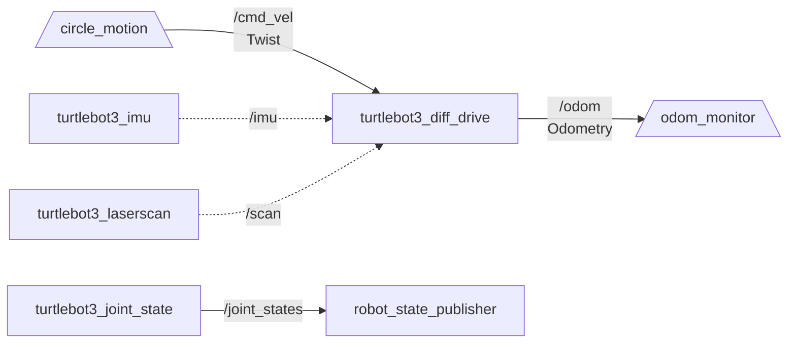
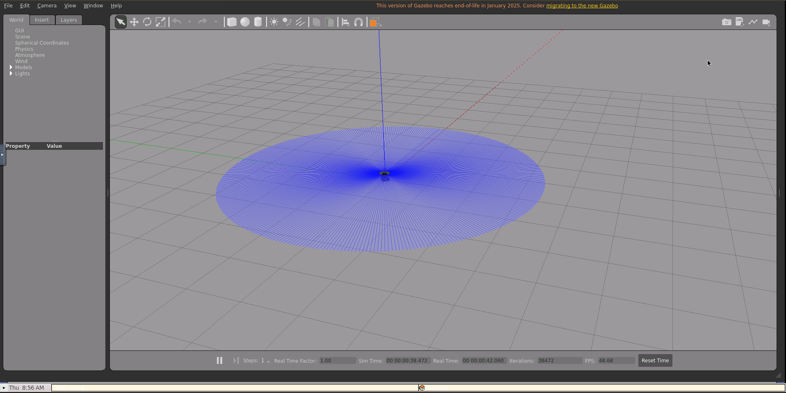
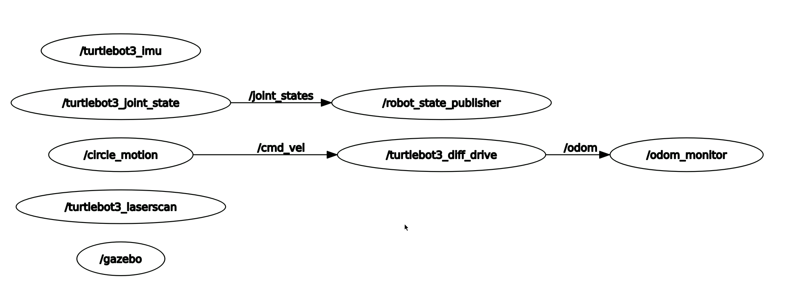

# Lecture 6: ROS 2 Fundamentals — Topics, Nodes & Communication — Solution

> DevOps for Cyber-Physical Systems | University of Bern

- **Name:** Prakash Aryan
- **ROS 2 Version:** Humble Hawksbill
- **Repository:** [github.com/prakash-aryan/lecture6-ros2demo](https://github.com/prakash-aryan/lecture6-ros2demo)

## ROS 2 Communication Architecture



## Package Structure

```
src/student_robotics/
├── launch/
│   └── robot.launch.py        # Launch both nodes together
├── resource/
│   └── student_robotics        # ament resource index marker
├── student_robotics/
│   ├── __init__.py
│   ├── circle_motion.py        # Velocity publisher (0.3 m/s, 0.5 rad/s, 10 Hz)
│   └── odom_monitor.py         # Odometry subscriber (position + velocity)
├── package.xml                 # Dependencies: rclpy, geometry_msgs, nav_msgs
├── setup.cfg
└── setup.py                    # Entry points: circle_motion, odom_monitor
```

## Quick Start (Solution Branch)

### 1. Open in Dev Container

```bash
git clone https://github.com/prakash-aryan/lecture6-ros2demo.git
cd lecture6-ros2demo
git checkout solution
code .
```

In VS Code: **F1** → "Dev Containers: Reopen in Container" — wait for build (first time ~10-15 min).

`student_robotics` is built automatically by the `post-start.sh` script.

### 2. Launch Gazebo (Terminal 1)

```bash
ros2 launch turtlebot3_gazebo empty_world.launch.py
```

### 3. Run Circle Motion (Terminal 2)

```bash
cd /workspace/turtlebot3_ws
colcon build --packages-select student_robotics
source install/setup.bash
ros2 run student_robotics circle_motion
```

### 4. Run Odom Monitor (Terminal 3)

```bash
source /workspace/turtlebot3_ws/install/setup.bash
ros2 run student_robotics odom_monitor
```

### 5. Or launch both at once

```bash
ros2 launch student_robotics robot.launch.py
```

---

# Aufgabe 1: Create ROS2 Package & Publisher-Subscriber Nodes

## (a) Package Creation & Circle Motion Publisher

Created package `student_robotics` with a publisher node `circle_motion.py` that drives the TurtleBot3 in a circle:

```python
import rclpy
from rclpy.node import Node
from geometry_msgs.msg import Twist


class CircleMotion(Node):
    """
    ROS 2 publisher node that drives TurtleBot3 in a circle.

    Publishes Twist messages to /cmd_vel at 10 Hz with:
      - linear.x  = 0.3 m/s   (forward speed)
      - angular.z = 0.5 rad/s  (turn rate)
    """

    def __init__(self):
        super().__init__('circle_motion')

        # Create publisher on /cmd_vel with QoS depth 10
        self.publisher = self.create_publisher(Twist, '/cmd_vel', 10)

        # 10 Hz timer -> callback every 0.1 s
        self.timer = self.create_timer(0.1, self.timer_callback)

        self.get_logger().info(
            'CircleMotion started — publishing to /cmd_vel at 10 Hz')

    def timer_callback(self):
        msg = Twist()
        msg.linear.x = 0.3   # m/s forward
        msg.angular.z = 0.5  # rad/s counter-clockwise
        self.publisher.publish(msg)
        self.get_logger().info(
            f'Velocity -> linear.x={msg.linear.x:.1f}, angular.z={msg.angular.z:.1f}')


def main(args=None):
    rclpy.init(args=args)
    node = CircleMotion()
    try:
        rclpy.spin(node)
    except KeyboardInterrupt:
        pass
    finally:
        # Stop the robot before shutting down
        stop_msg = Twist()
        node.publisher.publish(stop_msg)
        node.destroy_node()
        rclpy.shutdown()


if __name__ == '__main__':
    main()
```

**Testing — Build and run:**

```bash
cd /workspace/turtlebot3_ws
colcon build --packages-select student_robotics
source install/setup.bash
ros2 run student_robotics circle_motion
```

```
Starting >>> student_robotics
Finished <<< student_robotics [2.37s]

Summary: 1 package finished [56.2s]
[INFO] [1774515473.565195389] [circle_motion]: CircleMotion started — publishing to /cmd_vel at 10 Hz
[INFO] [1774515473.863745942] [circle_motion]: Velocity → linear.x=0.3, angular.z=0.5
[INFO] [1774515473.969675095] [circle_motion]: Velocity → linear.x=0.3, angular.z=0.5
[INFO] [1774515474.064554060] [circle_motion]: Velocity → linear.x=0.3, angular.z=0.5
[INFO] [1774515474.164401815] [circle_motion]: Velocity → linear.x=0.3, angular.z=0.5
[INFO] [1774515474.264625951] [circle_motion]: Velocity → linear.x=0.3, angular.z=0.5
...
```

**Robot moving in circles in Gazebo:**



**Why use `create_timer()`?**

`create_timer()` ensures the publisher sends velocity commands at a fixed frequency (10 Hz) by invoking the callback at regular intervals, decoupled from the main spin loop. Without a timer, we would need manual loop management and sleep calls, which is error-prone and blocks the node from processing other callbacks like subscriptions or services.

## (b) Odometry Subscriber

Created `odom_monitor.py` that subscribes to `/odom` and logs position (x, y) and velocities (linear.x, angular.z):

```python
import rclpy
from rclpy.node import Node
from nav_msgs.msg import Odometry


class OdomMonitor(Node):
    """
    ROS 2 subscriber node that monitors TurtleBot3 odometry.

    Subscribes to /odom and logs:
      - Position:   (x, y)
      - Velocities: (linear.x, angular.z)
    """

    def __init__(self):
        super().__init__('odom_monitor')

        # Subscribe to /odom with QoS depth 10
        self.subscription = self.create_subscription(
            Odometry,
            '/odom',
            self.odom_callback,
            10)

        self.get_logger().info(
            'OdomMonitor started — listening to /odom')

    def odom_callback(self, msg):
        # Extract position
        x = msg.pose.pose.position.x
        y = msg.pose.pose.position.y

        # Extract velocities
        vx = msg.twist.twist.linear.x
        wz = msg.twist.twist.angular.z

        self.get_logger().info(
            f'Position: x={x:.2f}, y={y:.2f} | '
            f'Velocity: linear.x={vx:.2f}, angular.z={wz:.2f}')


def main(args=None):
    rclpy.init(args=args)
    node = OdomMonitor()
    try:
        rclpy.spin(node)
    except KeyboardInterrupt:
        pass
    finally:
        node.destroy_node()
        rclpy.shutdown()


if __name__ == '__main__':
    main()
```

**Both nodes running — odom_monitor terminal output:**

```
[INFO] [1774515499.579080843] [odom_monitor]: OdomMonitor started — listening to /odom
[INFO] [1774515499.582496855] [odom_monitor]: Position: x=-0.50, y=0.36 | Velocity: linear.x=0.30, angular.z=0.50
[INFO] [1774515499.603736754] [odom_monitor]: Position: x=-0.49, y=0.35 | Velocity: linear.x=0.30, angular.z=0.50
[INFO] [1774515499.637242866] [odom_monitor]: Position: x=-0.49, y=0.34 | Velocity: linear.x=0.30, angular.z=0.50
[INFO] [1774515499.670841967] [odom_monitor]: Position: x=-0.49, y=0.33 | Velocity: linear.x=0.30, angular.z=0.50
[INFO] [1774515499.704259430] [odom_monitor]: Position: x=-0.48, y=0.32 | Velocity: linear.x=0.30, angular.z=0.50
[INFO] [1774515499.739537848] [odom_monitor]: Position: x=-0.48, y=0.31 | Velocity: linear.x=0.30, angular.z=0.50
[INFO] [1774515499.774530145] [odom_monitor]: Position: x=-0.47, y=0.30 | Velocity: linear.x=0.30, angular.z=0.50
[INFO] [1774515499.807936940] [odom_monitor]: Position: x=-0.47, y=0.29 | Velocity: linear.x=0.30, angular.z=0.50
[INFO] [1774515499.841032495] [odom_monitor]: Position: x=-0.46, y=0.28 | Velocity: linear.x=0.30, angular.z=0.50
[INFO] [1774515500.080109577] [odom_monitor]: Position: x=-0.42, y=0.22 | Velocity: linear.x=0.30, angular.z=0.50
[INFO] [1774515500.318336815] [odom_monitor]: Position: x=-0.38, y=0.17 | Velocity: linear.x=0.30, angular.z=0.51
[INFO] [1774515500.556955352] [odom_monitor]: Position: x=-0.33, y=0.12 | Velocity: linear.x=0.30, angular.z=0.50
[INFO] [1774515500.660003894] [odom_monitor]: Position: x=-0.30, y=0.10 | Velocity: linear.x=0.30, angular.z=0.51
```

**`ros2 node list` showing both nodes:**

```
/circle_motion
/gazebo
/odom_monitor
/robot_state_publisher
/turtlebot3_diff_drive
/turtlebot3_imu
/turtlebot3_joint_state
/turtlebot3_laserscan
```

**How does pub-sub decoupling work?**

In ROS 2 publish-subscribe, publishers and subscribers communicate through named topics without knowing about each other directly — the publisher writes messages to a topic, and any subscriber listening to that topic receives them independently. This means `circle_motion` can publish velocity commands to `/cmd_vel` without needing to know whether the simulation, a real robot, or nothing at all is subscribed to that topic. This decoupling allows nodes to be started, stopped, or replaced independently, making the system modular and resilient — for example, `odom_monitor` continues to receive `/odom` data from the simulation regardless of whether `circle_motion` is running.

---

# Aufgabe 2: ROS2 Topic Inspection & Message Frequency Analysis

## (a) ROS2 CLI Topic Commands

**`ros2 topic list` — all active topics:**

```
/clock
/cmd_vel
/imu
/joint_states
/odom
/parameter_events
/performance_metrics
/robot_description
/rosout
/scan
/tf
/tf_static
```

**`ros2 topic info /cmd_vel` — publishers and subscribers:**

```
Type: geometry_msgs/msg/Twist
Publisher count: 1
Subscription count: 1
```

**`ros2 topic info /odom`:**

```
Type: nav_msgs/msg/Odometry
Publisher count: 1
Subscription count: 1
```

**`ros2 topic hz /odom` — frequency:**

```
average rate: 29.373
        min: 0.033s max: 0.035s std dev: 0.00047s window: 31
average rate: 29.376
        min: 0.033s max: 0.035s std dev: 0.00046s window: 61
average rate: 29.351
        min: 0.033s max: 0.035s std dev: 0.00047s window: 91
average rate: 29.368
        min: 0.033s max: 0.037s std dev: 0.00056s window: 121
```

**`ros2 topic bw /odom` — bandwidth:**

```
Subscribed to [/odom]
21.32 KB/s from 29 messages
        Message size mean: 0.72 KB min: 0.72 KB max: 0.72 KB
21.52 KB/s from 59 messages
        Message size mean: 0.72 KB min: 0.72 KB max: 0.72 KB
```

**`ros2 node list` — all nodes:**

```
/circle_motion
/gazebo
/odom_monitor
/robot_state_publisher
/turtlebot3_diff_drive
/turtlebot3_imu
/turtlebot3_joint_state
/turtlebot3_laserscan
```

**`ros2 node info /circle_motion`:**

```
/circle_motion
  Subscribers:

  Publishers:
    /cmd_vel: geometry_msgs/msg/Twist
    /parameter_events: rcl_interfaces/msg/ParameterEvent
    /rosout: rcl_interfaces/msg/Log
  Service Servers:
    /circle_motion/describe_parameters: rcl_interfaces/srv/DescribeParameters
    /circle_motion/get_parameter_types: rcl_interfaces/srv/GetParameterTypes
    /circle_motion/get_parameters: rcl_interfaces/srv/GetParameters
    /circle_motion/list_parameters: rcl_interfaces/srv/ListParameters
    /circle_motion/set_parameters: rcl_interfaces/srv/SetParameters
    /circle_motion/set_parameters_atomically: rcl_interfaces/srv/SetParametersAtomically
  Service Clients:

  Action Servers:

  Action Clients:
```

### Answers

**What is `/odom` frequency? Why does frequency matter for robot control?**

The `/odom` topic publishes at approximately **29.4 Hz** (~30 Hz), matching the Gazebo physics simulation rate. Frequency matters because higher update rates provide smoother, more accurate position estimates, allowing the control loop to react faster to changes. If the odometry frequency is too low, the robot may overshoot targets or oscillate because the controller is working with stale position data.

**How many publishers and subscribers does `/cmd_vel` have? List them.**

`/cmd_vel` has **1 publisher** and **1 subscriber**:
- Publisher: `/circle_motion` (our node sending Twist velocity commands)
- Subscriber: `/turtlebot3_diff_drive` (Gazebo plugin that drives the simulated wheels)

**What's the difference between `ros2 topic hz` and `ros2 topic bw`?**

`ros2 topic hz` measures the **message frequency** — how many messages per second arrive on a topic (e.g., 29.4 Hz for `/odom`). `ros2 topic bw` measures the **bandwidth** — the actual data throughput in KB/s (e.g., 21.3 KB/s), which depends on both the message rate and the size of each message (0.72 KB for Odometry).

## (b) Visualize Communication Graph

**`rqt_graph` showing node communication:**



**What does the graph show? How are nodes connected?**

The rqt_graph shows the ROS 2 computation graph — each oval is a node and each labeled arrow is a topic carrying messages between them. `/circle_motion` publishes Twist messages on `/cmd_vel` to `/turtlebot3_diff_drive`, which controls the simulated wheels and in turn publishes Odometry on `/odom`, which `/odom_monitor` subscribes to. Other connections include `/turtlebot3_joint_state` sending `/joint_states` to `/robot_state_publisher`, while `/turtlebot3_imu`, `/turtlebot3_laserscan`, and `/gazebo` are standalone sensor nodes.

**What happens if you stop `circle_motion`? Does `odom_monitor` still work? Why?**

If `circle_motion` is stopped, the robot stops receiving velocity commands and coasts to a halt, but `odom_monitor` continues to work and receive odometry data from `/turtlebot3_diff_drive`. This is because pub-sub is decoupled — `odom_monitor` subscribes to `/odom` independently and the Gazebo simulation keeps publishing odometry regardless of whether any velocity commands are being sent.

---

## Cleanup

```bash
# Stop all nodes with Ctrl+C, then:
ros2 launch turtlebot3_gazebo empty_world.launch.py  # re-launch if needed
```

---

**University of Bern | DevOps for Cyber-Physical Systems**
